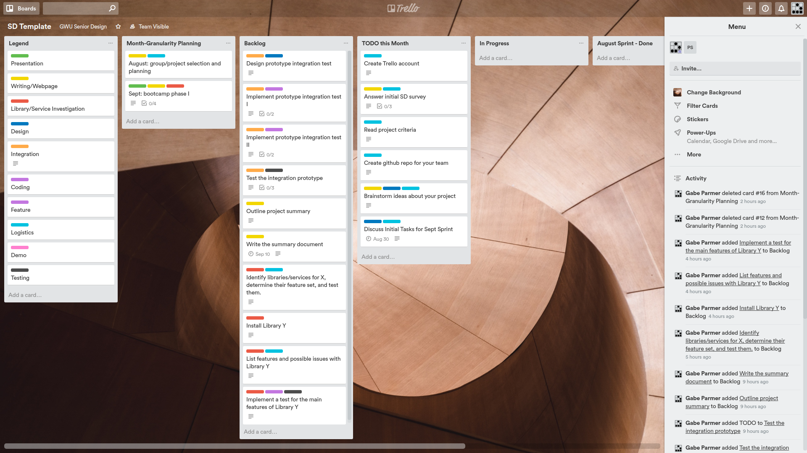

(Much of this material was provided by Prof. Gabe Parmer)

When you’re working on a team, you’re no longer just hacking away at a project at your own pace. Instead, you must check in with your project manager (SD mentor) and coordinate between team members, ensure that they synchronize their work at the right points, figure out who is working on which bug/feature, and generally work toward a larger goal without stepping on each other’s feat. To aid in this, you’ll be using both [Github](https://github.com)  and [Trello](https://trello.com) to orchestrate your project. This document details a set of conventions that we will use for senior design. These ensure that we’re all using these technologies in the same way, and they are similar to the constraints that your Project Manager (PM) would impose on you at a company.

## Trello ##

Trello is a technology that helps with project management, scheduling, and time management. It provides a nicely visual means of tracking different actions, categorizing them, assigning people to them, providing deadlines, and orchestrating the flow of the tasks that must be completed over time. You can find many [tutorials on how to use Trello](https://trello.com/guide/trello-101).

First, you should have provided your Trello user-name/email to the instructors by completing the class logistics survey handed out in the first week of class. We will then add you to your team workspace.  Second, you should not modify the SD template boards (for the first sprint). 

The template board is populated with a set of tasks (cards), and a set of lists we’ll be using to track monthly progress. It should look a little something like this:

 * The left-most list is simply a reference/legend for the meaning of the set of labels/colors. You might add your own labels, and add references to them in the legend. You won’t be modifying these often at all.
 * The highest-level planning is laying out your project’s main themes and tasks on a per-month basis. That is what the second list (“Month-Granularity Planning”) contains. This is the card that you should use to “tell the story” of your plan for the month. Note that I’ve only filled in the boot-camp phase months where it is hard to understand what the overall organization of your project will be. You have to elaborate on the bootcamp-phase months (see Sept, for example to see the placeholders you’ll need to flesh out), and you’ll have to add the subsequent months.
 * Each card in all other lists should be labeled properly, should be assigned to the correct team member. The description of each card should start with “Acceptance Criteria:” (which can be abbreviated as “AC:”) which spells out the criteria that must be satisfied to move this card to “Done”
 * Each month, you will have your set of tasks in the “TODO this Month” list. This will be the set of tasks that your team wishes to accomplish this “sprint”.
 * Each month, before the “Sprint Planning Meeting” (SPM) class, you should populate your “Backlog” list with all pending tasks. Each of these cards should be given a deadline of the next SPM. Once a card’s deadline has been set, do not change it. This is part of a contract between you and the professor, and due to academic integrity, your grade will be negatively adjusted if you do so. During that class, you will discuss your next sprint with your mentor. You’ll cover each task that is left in TODO that you didn’t get to, and the tasks in the backlog that you’ll move over to the TODO list to form the month’s worth of development
 *  During a month, if you need to add cards during a sprint that you didn’t foresee, please do. However, these cards do not lighten the load or expectations you have for the sprint.
 *  Remember that your grade will be based on your ability to deliver on the cards in your TODO for the month, and they must consistently built up to a completed project.
 *  You will often want to create references between cards. To do this, find the “Share and more…” link in the bottom right of each card. Selecting the link will provide a highlighted link to the card that you can copy and paste into other cards, which creates the link. You can also use these links on Github (in a pull request, or in an issue)
 
## Trello and Sprint Planning Meetings (SPM) ##
 
Your sprint planning meetings are essential for enabling your mentor to track your progress, to help you move your project forward, and to provide a basis for your grade. If you don’t take these seriously, and prepare well for them, it will have a negative impact on your progress and grade.

### The SPM Meeting. ### 
In the SPMs, you will have 10 minutes to
 * Describe why any cards with a deadline of the current SPM in the TODO column have not been completed. You should simplify this process by providing comments in the corresponding cards detailing the difficulties you’ve had that prevented you from finishing in time.
 *  Describe the “story” for the coming sprint (month). You should set up the card in the “Month-Granularity Planning” list for the month to tell this story. Each of these cards should include a checklist. Each item in the checklist summarizes a high-level task, and include a set of references to the actual cards in the “Backlog” that constitute this higher-level task. See the card for Sept that we’ve populated with a subset of what you’ll want to accomplish for the month.
 *   Include all of the tasks that you believe constitute sufficient progress for the sprint/month in the “Backlog”. Each of these cards should have their deadline set to the next SPM date. They are what you’re promising to complete for the sprint. Given that these are part of the contract between you and your SD Mentor, you cannot modify them aside from adding to them. Once your SD Mentor approves the story for the sprint, and these constituent cards, you must move them into “TODO this Month”. If you still have cards that you haven’t completed in the previous sprint in “TODO this Month”, you must leave them there, cannot change their deadline, and must complete them in addition to the next month’s worth of tasks.

Your SD mentor will likely ask questions to understand your story and cards, so be prepared to walk them through your cards.
<b> Preparation for the SPM Meeting </b> You *must* prepare for the SPM meeting. Given the organization of the meeting, you must spend significant time creating your cards for the coming sprint in “Backlog”, and summarizing them in the “Month-Granularity Planning” card. The easiest way to get a bad grade in this class is to not take this preparation seriously.
<b> During the sprint/month. </b> If you are currently working on a card, you will move it from “TODO this Month” into the “In Progress” list. As you work through your tasks for the month and complete them, you will move them into the “August Sprint - Done” list (replace “August” with the current sprint’s month). .
You might also realize that one of your cards should actually be more fine-grained, motivating you to add new cards. This might happen when you learn more information about the system, and find out that more work is necessary. For cards that you add during a sprint, they are not part of the contract of work for the month with your SD Mentor, so you should not put a deadline on them. Other than that, treat them as a normal card. You are expected to generate a steady stream of cards throughout the sprint as sprint planning is never perfect
<b> During the Weekly Standup Meeting (Project Update meeting ) </b> Your group meets weekly with your SD Mentor (you must meet at least bi-weekly). These meetings are to discuss weekly progress, and to use your mentor and peers as resources.  We suggest all team members attend this meeting together, even though each of you has to come prepared to meet the mentor. So each team should discuss and coordinate before the project update meeting.  Please come prepared to speak for maximum 10 minutes, and summarize:
 * your group’s progress over the week through the cards you’re working on and have completed,
 *  how they relate to the overall story for the sprint, and
 *  any difficulties or questions you have.
In these standup meetings, your SD Mentor is there to help. Make use of them accordingly. Note that they will be unlikely to be able to help you with deeper technical issues in these meetings. If you need that, schedule a meeting with them. In the end, *you’re responsible for your own technical progress.*

## Github ##

Github is based on git and is your means of collaborating with others when writing and modifying code. We are not going to do a deep dive into using git here, and expect that you can figure out the main features online. Some quick git tips can be found at the bottom of Prof Parmer's [software engineering guide](https://www2.seas.gwu.edu/~gparmer/posts/2017-06-08-sweng-in-research.html).
Github provides a wonderful set of repository management features online. You can go through the github [bootcamp](https://docs.github.com/en/get-started)if you don’t know how to use it.
You can use git to coordinate between team members in many different ways. You must use the [feature branch workflow pattern](https://www.atlassian.com/git/tutorials/comparing-workflows#feature-branch-workflow) of interaction for senior design. Please read about the details there. At the highest-level, this means that each team member will be working on their features on separate branches, and will integrate them into the mainline to coordinate with everyone else.

### Issues ###
In addition to interacting with github with git and issuing Pull Requests (PRs), you’ll be using github’s issues to track bugs.
 * As the month progresses, you’ll find bugs that need to get solved. For these, you’ll simply add them to github’s built-in issue tracker when you encounter them. Always label the correct team member who should address the issue.
 *  When you issue PRs, you should reference (URL link) to the Trello cards they correspond to, and/or to the issue they solve.
 *  Correspondingly, issues should reference Trello cards where appropriate.

### Commit/Pull Request Frequency ###

Part of your grade will depend on steady progress. We will partially be evaluating this progress based on the monthly sprint planning meetings and your Trello tasks, but also on your commit and PR frequencies. You should focus on issuing PRs for individual features (or, often, sub-features), and you generally don’t want your PRs to be more than 400 lines of code.
When you issue a PR, make sure that you @-mention your teammates that could benefit from seeing the new code, or from doing a code review. Part of doing a PR is to get feedback from your team-mates. You can also construct a PR of relevant code if you want to go through it with your mentor.

### Style ###
Please document in your repository (e.g. in the README.md) which coding style you’re using. It is important, when you’re working on a team to use a consistent style. It is more important to choose one and stick with it, than to choose the “perfect style”. You can find many different styles online, including
 * Google's C++ [style](https://google.github.io/styleguide/cppguide.html)
 * Google's Java [style](https://google.github.io/styleguide/javaguide.html) 
 * Google's Python [style](https://google.github.io/styleguide/pyguide.html) 
 * Linux C [style ](https://www.kernel.org/doc/html/v4.10/process/coding-style.html) 
GWU OS research group [C style](https://github.com/gwsystems/composite/blob/ppos/doc/style_guide/composite_coding_style.pdf) 
Many modern languages have prescribed styles such as[go ](https://pkg.go.dev/cmd/gofmt). 
 
### Project Webpage ###
 You <b> must </b> use [Github pages](https://pages.github.com/) for your project (see the gh-pages branch on your repo). For the most part, you have visual freedom with it, though you must only avoid posting inappropriate material. See the class’s submission guidelines for some required content: you must post as pdfs all written assignments, and all presentations.
   
